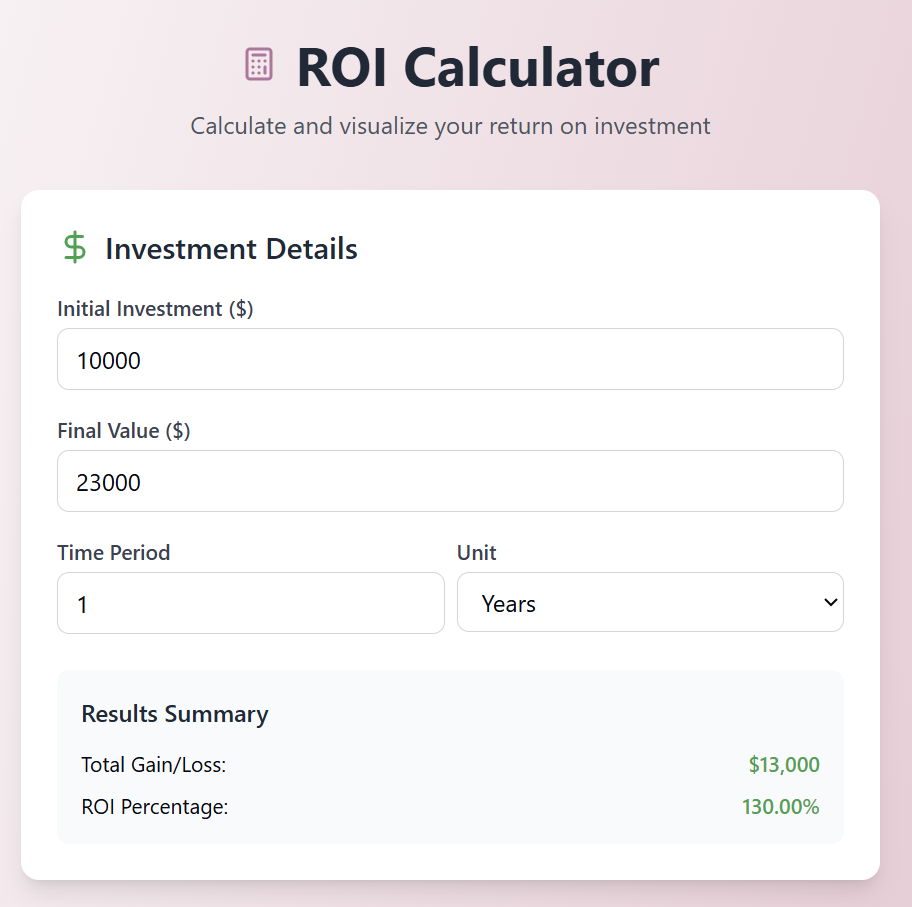
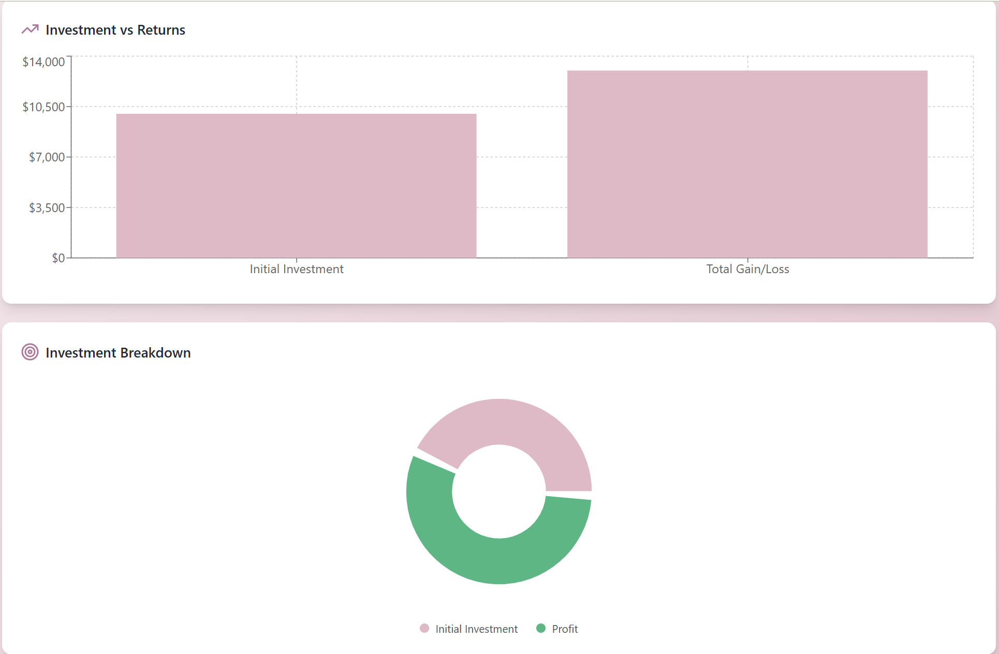
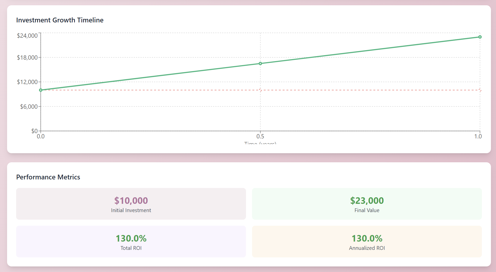

---

# ROI Calculator – Built by Desirée Salvant

**Smarter investment analysis, made simple.**  
This ROI Calculator is a modern web application designed to simplify return analysis. Built with React and visualized using Recharts, the tool enables professionals to measure and compare investment performance in real time with clarity and confidence.

---

**Features**

- Real-time ROI and annualized return calculations  
- Visualizations using bar charts, pie charts, and timelines  
- Responsive design for desktop and mobile  
- Clean, intuitive user interface  
- Immediate feedback with gain/loss breakdowns

---

**Live Demo**

Access the live application here: **[https://desireesalvant.github.io/roicalculator/t your hosted app link here]**

No installation required.

---

**Executive Summary**

The ROI Calculator was developed to address a key business need: helping decision-makers quickly assess the value and performance of their investments. Traditional spreadsheets can be cumbersome and difficult to interpret. This application introduces a visual, intuitive alternative that presents clear metrics and insights in seconds. Designed for business analysts, financial teams, and growth-focused leaders, this tool is ideal for comparing investments over time and understanding both short- and long-term returns.

---

**Screenshots**

  
  

---

**Built With**

- React  
- Recharts  
- Tailwind CSS  
- Lucide React Icons

---

**Planned Improvements**

- Add support for comparing multiple investments  
- Export results to CSV or PDF  
- Introduce dark mode  
- Add inflation adjustment and ROI forecasting

---

**Connect With Me**

- 🌐 Website: [desireesalvant.com](https://desireesalvant.com)  
- 💼 LinkedIn: [linkedin.com/in/desireesalvant](https://linkedin.com/in/desireesalvant)  
- 📊 Tableau Public: [public.tableau.com/app/profile/desiree.salvant](https://public.tableau.com/app/profile/desiree.salvant)  
- 🖥️ GitHub: [github.com/DesireeSalvant](https://github.com/DesireeSalvant)  
- 📫 Email: desireesalvant@gmail.com

---

**Disclaimer**  
This project is intended for educational and portfolio purposes only.  
No part of this content may be copied, reproduced, or reused without permission.
